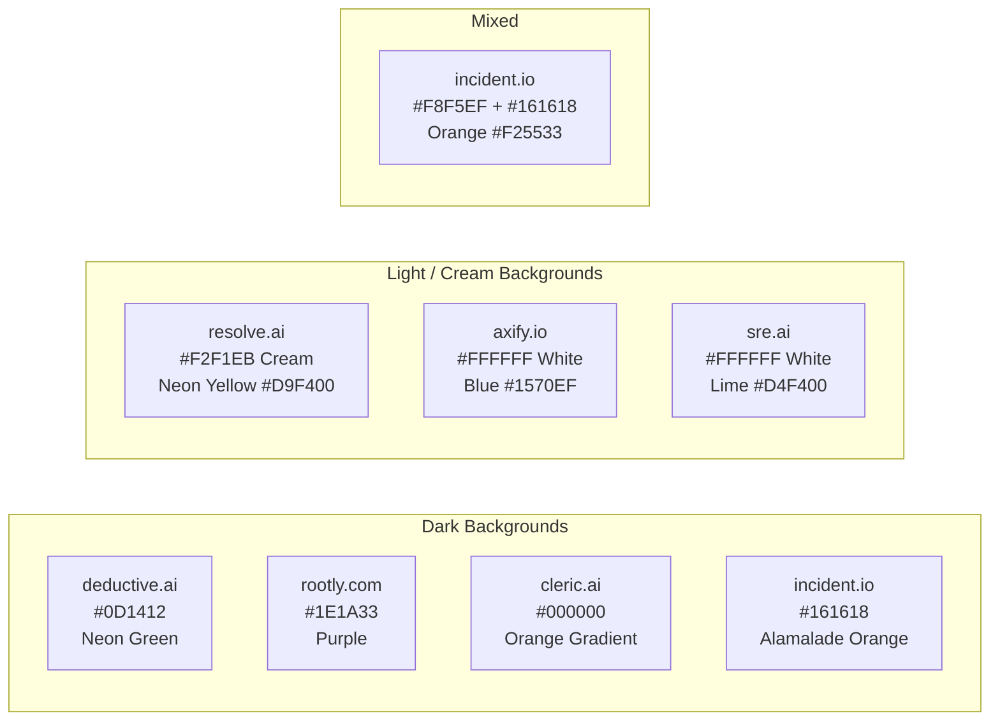
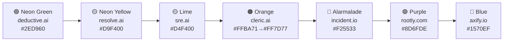
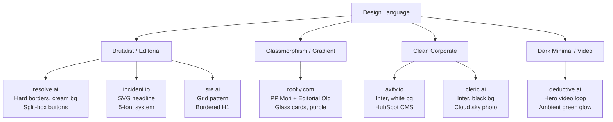
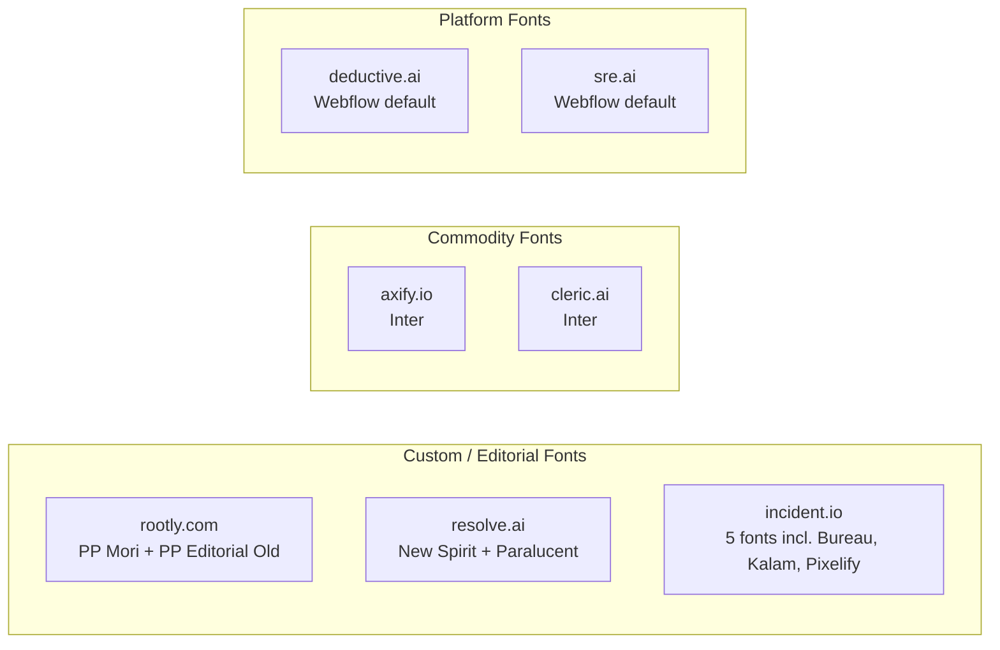
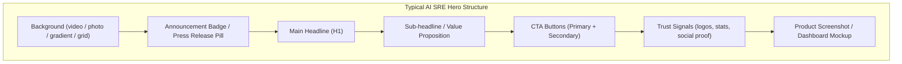
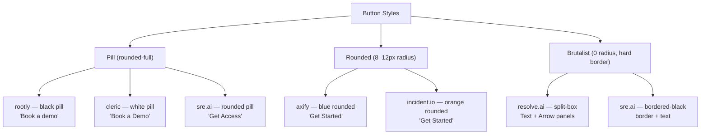
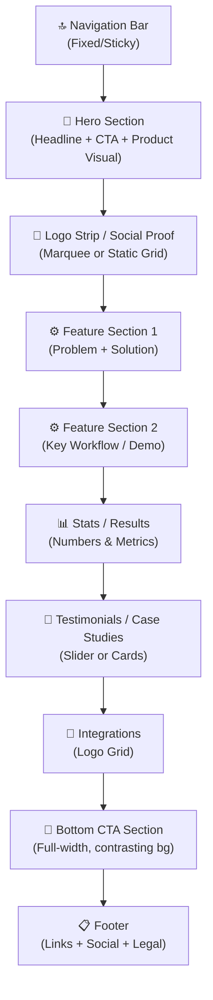
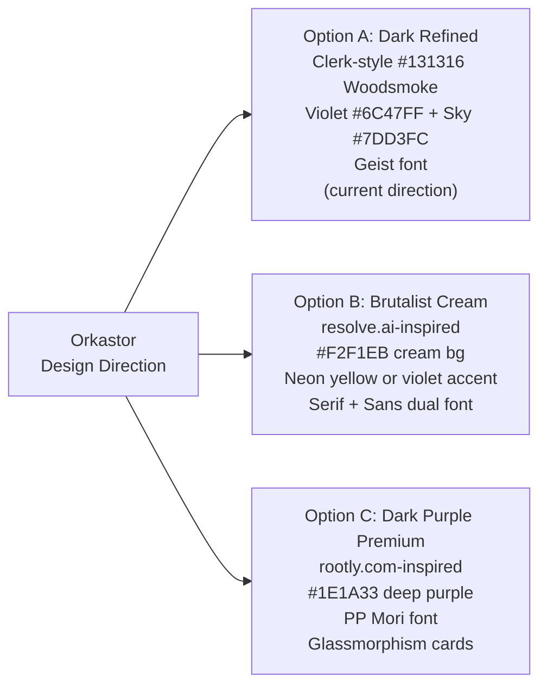
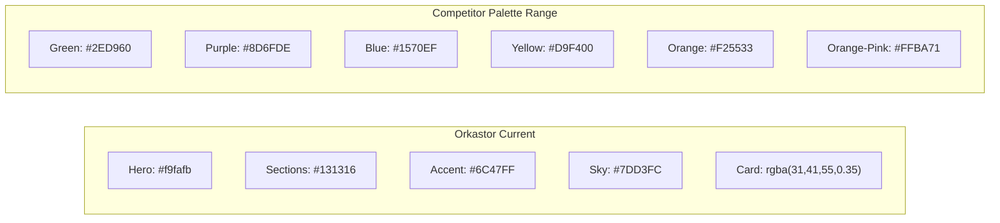

# AI SRE / Incident Management — Design Research
> Competitive analysis of 7 leading websites: design systems, themes, typography, components

---

## Sites Analysed

| # | Site | Category |
|---|------|----------|
| 1 | [deductive.ai](https://www.deductive.ai/) | AI SRE |
| 2 | [rootly.com](https://rootly.com/) | AI SRE / Incident |
| 3 | [axify.io](https://axify.io/) | Eng Intelligence |
| 4 | [resolve.ai](https://resolve.ai/) | AI SRE |
| 5 | [incident.io](https://incident.io/) | Incident Management |
| 6 | [cleric.ai](https://cleric.ai/) | AI SRE |
| 7 | [sre.ai](https://www.sre.ai/) | AI Reliability |

---

## 1. Site-by-Site Design Breakdown

### 1.1 deductive.ai — Dark Green / Video Hero

**Theme:** Dark, deep green-black, minimal, video-forward

| Token | Value |
|-------|-------|
| Page bg | `#0D1412` (dark green-black) |
| Hero bg | Dark green + looping video + `hero-glow.png` ambient glow |
| Primary accent | `#2ED960` (bright neon green) |
| Secondary | `#4d65ff` (blue, focus/outline) |
| Text dark | `#FFFFFF` |
| Text muted | `#8d9895` (muted gray-green) |
| Gradient text | `linear-gradient(180deg, #fff, #8d9895)` |
| Button | Dark green bg, white text |
| Font | Custom (Webflow CDN) geometric sans |
| CTA | "Book a Demo" — dark bg, white text, arrow animation |

**Distinctive elements:**
- Looping **background video** in hero
- Large ambient **green glow PNG** behind headline
- Decorative **rhombus SVG diamonds** as section dividers
- Integration logo grid with **flip-card animations**
- Testimonial slider with `[ 01 / 04 ]` bracket numbering

---

### 1.2 rootly.com — Dark Purple / Glassmorphism

**Theme:** Dark deep purple hero, light purple sections, glassmorphism cards

| Token | Value |
|-------|-------|
| Hero bg | `#1E1A33` (deep dark purple) |
| Light section bg | `#FDFDFF` / `#F7F5FF` |
| Nav bg | `#FBFAFF` (solid, light purple-white) |
| Card bg | `#F7F5FF` |
| Primary accent | `#8D6FDE` (medium purple) |
| Deep purple | `#4A3E8A` |
| Orange secondary | `#F0883E` |
| Glass light | `rgba(233,226,255,0.5)` |
| Glass dark | `rgba(30,26,51,0.7)` |
| Text (light bg) | `#787685` (muted purple-gray) |
| Font heading | **PP Mori** (geometric sans) |
| Font display | **PP Editorial Old** (serif) |
| Body size | 16–20px, weight 200/500/600 |

**Distinctive elements:**
- **Two-font editorial system**: PP Mori + PP Editorial Old (serif)
- Mega-nav dropdown with **brand-coloured customer story cards**
- **Three overlapping hero dashboard screenshots** (mid, left-offset, right-offset)
- Dual-row **opposite-direction marquee** (Figma, Nvidia, Dropbox, Elastic logos)
- Gradient badge: `.gradient-span` with purple gradient text
- GSAP scroll animations

---

### 1.3 axify.io — Clean Light / Corporate Blue

**Theme:** Pure white, corporate SaaS, Inter-based, HubSpot CMS

| Token | Value |
|-------|-------|
| Page bg | `#FFFFFF` |
| Nav bg | `#FFFFFF` (solid) |
| Primary accent | `#1570EF` (blue) |
| CTA section bg | `#1849A9` (dark blue) |
| Footer bg | `#0C111D` (near-black navy) |
| Footer row | `#114245` (dark teal gradient) |
| Green accent | `#63DA7B` (links & blog borders) |
| Primary button | `#146FEF` bg, white text |
| Secondary button | `#EFF8FE` bg, `#373E47` text |
| Nav link color | `#475467` (slate gray) |
| Font | **Inter** (all elements, Google Fonts) |
| H1 size | 50px, weight 700 |
| H2 size | 38px, weight 700 |
| Body | 18px, weight 400 |

**Distinctive elements:**
- Atmospheric **mountain/cloud background image** in hero
- Blog cards with 5px `#63DA7B` green bottom-border accent
- Very **enterprise/corporate** feel — less startup

---

### 1.4 resolve.ai — Warm Cream / Brutalist / Neon Yellow

**Theme:** Warm cream background, brutalist borders, neon yellow-green accent, premium serif typography

| Token | Value |
|-------|-------|
| Page bg | `#F2F1EB` (warm cream) |
| Nav bg | `#F2F1EB` (sticky) |
| Card bg | `#F8F8F5` / `#FFFFFF` |
| Primary accent | `#D9F400` (neon yellow-green) |
| Dark | `#222222` |
| Primary button | `#D9F400` bg, `#222222` text |
| Dark button | `#1A1A1A` bg, `#D9F400` text |
| Green (checks) | `#22C55E` |
| Orange accent | `#FFA440` |
| Cyan accent | `#22D3EE` |
| Borders | `1px solid #222222` (hard, no shadow) |
| Border-radius | ~0 (brutalist), some `10px` |
| Font heading | **New Spirit** (contemporary serif) |
| Font body | **Paralucent** (geometric sans) |
| Hero H1 size | `80px–100px`, `font-medium` |
| Body | 16–18px, `font-light` |

**Distinctive elements:**
- **Brutalist design** — hard borders, no box-shadows, square corners
- **Split-box CTA buttons** — left text panel + right arrow panel, both in `#D9F400`
- **Cream `#F2F1EB` background** — warm, distinctive, not plain white
- Trusted by Coinbase, DoorDash, Salesforce, MongoDB, Zscaler

---

### 1.5 incident.io — Warm Mixed / Alarmalade Orange / Editorial Multi-Font

**Theme:** Mixed light/dark with warm tones, striking orange brand, SVG-rendered hero headline

| Token | Value |
|-------|-------|
| Light bg | `#F8F5EF` (warm linen/cream) |
| Dark bg | `#161618` (near-black) |
| Nav bg | `#FFFFFF` |
| Card bg | `#FFFFFF` with `border #ECECED` |
| Primary accent | `#F25533` ("alarmalade" orange) |
| Orange variants | `#FF492C`, `#DD340E`, `#F1CD98` |
| Dark accent | `#5A0A17` / `#4A0611` (deep wine/maroon) |
| Blue accent | `#4B73FF` |
| Border | `#ECECED` |
| Shadow | `rgba(22,22,24,0.16)` |
| CTA button | `#F25533` bg, white text |
| Font 1 | **STK Bureau Sans** (main UI) |
| Font 2 | **STK Bureau Serif** (display) |
| Font 3 | **Geist Mono** (code) |
| Font 4 | **Kalam** (handwritten casual) |
| Font 5 | **Pixelify Sans** (pixel/retro) |

**Distinctive elements:**
- **SVG-path-rendered H1 headline** — "Move fast when you break things" drawn as inline SVG paths, not text
- **"Alarmalade" orange** — custom named color token (`#F25533`) used 196+ times across the site
- **5-font system** creating editorial collage feel
- **Deep maroon sections** `#5A0A17` — unique, unused elsewhere in the space
- Dark panel with dashboard screenshots — `box-shadow: 0px 15px 37.5px -9px rgba(22,22,24,0.16)`
- Swiper carousel for testimonials/case studies

---

### 1.6 cleric.ai — Black / Sky Photo Hero / Orange Gradient

**Theme:** Dark black dominant, real cloud sky photograph as hero background, warm orange-pink gradient accents

| Token | Value |
|-------|-------|
| Page bg | `#000000` / `#313131` |
| Nav bg | Black (mode-dark) |
| Hero bg | Full-width **cloud sky photo** + dark overlay |
| Card bg | `#313131` (dark charcoal) |
| Light card bg | `#F7F9FA` |
| Gradient accent | `#FFBA71 → #FF7D77` (orange-pink) |
| Purple accent | `#C084FC` |
| White overlay | `rgba(255,255,255,0.3)` |
| Text | `#FFFFFF` / `#6B6B6B` (muted gray) |
| Primary CTA | White pill button, dark text |
| Secondary CTA | Transparent outline pill, white text |
| Border | `#EAEAEA` (light gray) |
| Font | **Inter** (Google Fonts, 300–700) |
| H1 style | `text-title-case`, `ligatures-on`, white |
| Stats style | Large white numbers |

**Distinctive elements:**
- **Real sky/cloud photograph** as hero background — unique metaphor for "cloud"
- **Top announcement banner** — "Cleric Named a Gartner® Cool Vendor 2025"
- Stats strip: "5 min Root Cause / 92% Actionable / 200,000+ Investigations"
- **Press release badge** pill in hero: "Press release" orange + text
- Hero image fade-in via CSS transform animation
- Orange-pink gradient slider track (`#FFBA71 → #FF7D77`)

---

### 1.7 sre.ai — White/Black / Grid Background / Lime Green / Brutalist Grid

**Theme:** Light dominant with bold dark sections, grid-pattern background, lime accent, enterprise focus

| Token | Value |
|-------|-------|
| Page bg | `#FFFFFF` |
| Dark sections | `#000000` / very dark |
| Nav bg | White (transparent scroll) |
| Primary accent | `#D4F400` (lime yellow-green) |
| Dark button | `#000000` bg, white text |
| Lime button | Black on lime (`solid-black-on-lime`) |
| Tag bg | Black, white text |
| Slide colors | Magenta, Apricot, Lilac, Sky, Clay, Lime |
| Font | Custom geometric sans (Webflow) |
| H1 | Inside `bordered-header` decorative border box |
| Headline style | `bordered-header---no-bottom-rounded` |

**Distinctive elements:**
- **Grid-background dot/line pattern** behind hero video — structured technical feel
- **Bordered-header H1** — headline visually framed in a decorative border box
- **6-color action slider** (magenta / apricot / lilac / sky / clay / lime)
- **Lottie animations** extensively used for all illustrations
- **Footer gradient band** with brand slogan
- Top announcement strip: "SRE.ai raised $7.2M seed round, led by Salesforce Ventures"
- Backed by: Google, Microsoft, Deloitte alumni + Salesforce Ventures, YC

---

## 2. Comparative Analysis

### 2.1 Color Strategy Map



### 2.2 Accent Color Spectrum



### 2.3 Design Language Classification



### 2.4 Typography System Comparison



### 2.5 Hero Section Anatomy



### 2.6 Navigation Bar Patterns

```mermaid
stateDiagram-v2
  [*] --> AtTop
  AtTop --> OnScroll

  state AtTop {
    bg: "Transparent or Light"
    text: "Dark (light bg) or White (dark bg)"
    cta: "Pill or rounded button"
  }

  state OnScroll {
    bg: "Solid or Glass Dark"
    text: "White (all sites)"
    cta: "Same style, sticky"
  }
```

---

## 3. Common Patterns Across All 7 Sites

| Pattern | Sites Using It |
|---------|---------------|
| Dark hero section | deductive, rootly, cleric, incident.io, sre.ai (dark blocks) |
| Logo marquee / scrolling strip | deductive, rootly, axify, cleric |
| Background video / Lottie | deductive, sre.ai, cleric |
| Pill-shaped buttons | rootly, cleric, sre.ai, incident.io |
| Announcement banner/pill | cleric (Gartner), sre.ai (funding), incident.io |
| Dashboard screenshot in hero | rootly, cleric, incident.io, resolve.ai |
| Stats strip (numbers) | cleric (5min/92%/200k+), rootly |
| Custom/editorial font system | rootly, resolve.ai, incident.io |
| Brutalist elements (hard borders) | resolve.ai, sre.ai, incident.io |
| Cream/warm background (not white) | resolve.ai (#F2F1EB), incident.io (#F8F5EF) |

---

## 4. Button Style Taxonomy



---

## 5. Section Flow / Page Structure



---

## 6. Key Takeaways & Recommendations for Orkastor

### What Stands Out as Best-in-Class

1. **rootly.com** — Most polished overall. PP Mori + Editorial Old font pairing creates premium authority. Glassmorphism cards with dark purple hero feel premium.

2. **resolve.ai** — Most distinctive. Brutalist cream bg + `#D9F400` neon yellow + New Spirit serif = highly memorable. Split-box button is a signature element.

3. **incident.io** — Most ambitious. SVG headline, 5-font system, and alarmalade orange create a completely ownable brand. The maroon dark sections are unique.

4. **cleric.ai** — Best structured dark site. Cloud sky photo is clever, stats strip is credible, Gartner badge is trust-building.

### Design Directions for Orkastor



### Recommended Improvements to Current Orkastor Design

| Area | Current | Recommended |
|------|---------|-------------|
| Hero bg | Light `#f9fafb` | Keep — best in class for contrast |
| Dark sections | `#131316` | ✅ Correct (Clerk Woodsmoke) |
| Accent | `#6C47FF` violet | ✅ Distinctive in AI SRE space |
| Typography | Geist (Clerk font) | ✅ Premium, system-level authority |
| Hero visual | 3-panel dashboard mockup | Consider full-width floating screenshot (cleric/rootly style) |
| Logo strip | Static company names | Consider scrolling marquee with actual logos |
| Announcement pill | KubēGraf v1.0 | ✅ Good, matches cleric pattern |
| Stats strip | None | Add below logo bar (e.g. "18s MTTR / 142 resolved / Zero exfiltration") |
| CTA button | Violet gradient pill | ✅ Matches industry standard |
| Card style | Glass `rgba(31,41,55,0.35)` | ✅ Matches Clerk/Rootly glass cards |

---

## 7. Color Palette Quick Reference



---

*Research conducted February 2026 — live site analysis via HTML/CSS source inspection.*
