# Orkastor Platform Architecture

> Full platform architecture showing the AI Agent, Orchestrator, vCluster Controller,
> Cloud Abstraction layer, KubēGraf SRE Module, and SaaS business model.

```mermaid
flowchart TB
    %% ── Users ──────────────────────────────────────────────────
    Users["👥 Users\n─────────────────\n• User Management\n• Cluster Creation\n• Multi-Cloud SaaS for K8s Clusters"]

    %% ── AI Agent ────────────────────────────────────────────────
    Agent["🤖 O6R AI\nAI Agent"]

    %% ── Core Orchestrator ───────────────────────────────────────
    Orchestrator["⚡ Orkastor Orchestrator\n(Cloud & DevOps Orchestrator)"]

    %% ── Pricing — Orchestrator tier ────────────────────────────
    subgraph SaaS1["SaaS Business Model — Orchestrator"]
        direction LR
        Starter1["Starter\n$"]
        Pro1["Pro\n$$"]
        Epro1["Epro\n$$$"]
        UsageBased1["Usage-Based\nvCPU / RAM / Volume  $"]
    end

    %% ── vCluster Controller ─────────────────────────────────────
    vCluster["🗄️ vCluster Controller"]

    %% ── Cloud Providers ─────────────────────────────────────────
    subgraph Clouds["Cloud Providers"]
        direction LR
        AWS["☁️ AWS"]
        GCP["☁️ GCP"]
        Azure["☁️ Azure"]
    end

    %% ── Cloud Abstraction ───────────────────────────────────────
    subgraph Abstraction["Cloud Abstraction Layer"]
        direction LR
        Terraform["Terraform"]
        Pulumi["Pulumi"]
        OpenTofu["OpenTofu"]
    end

    Provisioning["Provisioning & Cost Optimization\nTerraform / Pulumi / OpenTofu"]

    %% ── Managed Services ────────────────────────────────────────
    subgraph Services["Managed Cluster Services"]
        direction LR
        Monitoring["📊 Cluster\nMonitoring"]
        AutoScale["⚖️ Auto\nScaling"]
        Security["🛡️ Security\nAutomation"]
    end

    %% ── Infrastructure ──────────────────────────────────────────
    Infra["🌐 Fully Managed Multi-Cloud Kubernetes Infrastructure"]

    %% ── KubēGraf SRE Module ─────────────────────────────────────
    subgraph KubeGraf["KubēGraf — SRE Module"]
        direction TB
        KG_Label["• Cluster Monitoring\n• Root-Cause Analysis\n• Incident Insights"]
    end

    %% ── Pricing — KubēGraf tier ─────────────────────────────────
    subgraph SaaS2["SaaS Business Model — KubēGraf"]
        direction LR
        Starter2["Starter\n$"]
        Pro2["Pro\n$$"]
        Ent2["Enterprise\n$$$"]
        UsageBased2["Usage-Based\nvCPU / RAM / Volume"]
        PPC["Pay-Per-Cluster  $"]
        Addons["Premium Add-ons\n• Advanced AI Insights\n• Compliance & Security\n• Marketplace Templates"]
    end

    %% ── Edges ───────────────────────────────────────────────────
    Users       -->|"sends requests"| Agent
    Agent       -->|"orchestrates"| Orchestrator
    Orchestrator -->|"subscription"| SaaS1
    Orchestrator <-->|"provisions clusters"| vCluster
    vCluster    <-->|"cloud APIs"| Clouds
    vCluster    -->|"IaC"| Abstraction
    Abstraction -->|"cost & provision"| Provisioning
    Abstraction -->|"deploys"| Services
    Services    -->|"powers"| Infra
    KubeGraf    -->|"monitors"| Services
    Infra       -->|"billing"| SaaS2

    %% ── Styles ──────────────────────────────────────────────────
    classDef core fill:#0d1b2a,stroke:#2dd4bf,stroke-width:2px,color:#f1f5f9
    classDef agent fill:#0d1b2a,stroke:#3b82f6,stroke-width:2px,color:#f1f5f9
    classDef infra fill:#0d1b2a,stroke:#6366f1,stroke-width:1.5px,color:#f1f5f9
    classDef saas fill:#0d1b2a,stroke:#10b981,stroke-width:1px,color:#94a3b8

    class Orchestrator,vCluster core
    class Agent agent
    class Infra,Provisioning infra
    class Starter1,Pro1,Epro1,UsageBased1,Starter2,Pro2,Ent2,UsageBased2,PPC,Addons saas
```

## Key Components

| Component | Role |
|---|---|
| **O6R AI Agent** | Central intelligence layer — receives user intent, drives orchestration decisions |
| **Orkastor Orchestrator** | Core platform engine — manages cluster lifecycle, routing, and AI workflows |
| **vCluster Controller** | Virtual cluster provisioner — creates isolated K8s environments on demand |
| **Cloud Abstraction** | IaC layer (Terraform / Pulumi / OpenTofu) — cloud-agnostic provisioning |
| **KubēGraf SRE Module** | Flagship AI SRE module — monitoring, RCA, and auto-remediation for Kubernetes |

## Pricing Models

### Orchestrator
- **SaaS tiers:** Starter · Pro · Epro
- **Usage-based:** vCPU / RAM / Volume

### KubēGraf
- **SaaS tiers:** Starter · Pro · Enterprise
- **Usage-based:** vCPU / RAM / Volume
- **Pay-Per-Cluster**
- **Premium add-ons:** Advanced AI Insights · Compliance & Security · Marketplace Templates

## Cloud Support

AWS · GCP · Azure — with cost-efficient Spot / preemptible node support.
